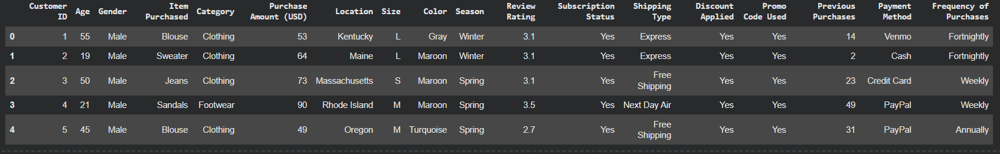

# Customer Purchasing Behavior Analysis

## 1. Overview
This project analyzes customer purchasing behavior using transaction data from 3,900 purchases across various product categories. 
The goal is to uncover insights into spending patterns, customer segments, product preferences, and subscription behavior to guide strategic business decisions.

---

## 2. Dataset Summary 
- **Rows:** 3,900
- **Columns:** 18
- **Missing data:** 37 values in the Review Rating column

### Key Features

| Fields | Variables |
| :--- | :--- |
| Customer demographics | Age, Gender, Location, Subscription Status |
| Purchase details | Item Purchased, Category, Purchase Amount, Season, Size, Color |
| Shopping behavior | Discount Applied, Promo Code Used, Previous Purchases, Frequency of Purchases, Review Rating, Shipping Type |

---

## 3. EDA using Python
[View details](Initial-data.png)

### Initial Exploration

### Data Processing

| Procedure | Details |
| :--- | :--- |
| **Handling Missing values** | Check for null values and fill in any missing values in the Review Rating column using the median rating for each product category. |
| **Standardization** | Convert the columns to snake case. |
| **Feature Engineering** | - Create an `age_group` column by grouping customers by age. - Create a `purchase_frequency_days` column from the purchase data. |
| **Data Consistency** | Verify that `discount_applied` and `promo_code_used` are duplicates; `promo_code_used` has been removed. |

---

## 4. Data Analysis using SQL 
[View details](link_to_your_sql_file_here)

### 4.1. Revenue by Gender 
 

### 4.2. High-Spending Discount Users 
 

### 4.3. Top 5 Products by Rating 
 

### 4.4. Shipping Type Comparison 
 

### 4.5. Subscribers vs. Non-Subscribers 

### 4.6. Discount-Dependent Products
 

### 4.7. Customer Segmentation 
 

### 4.8. Top 3 Products per Category 
 

### 4.9. Repeat Buyers & Subscriptions 
 

### 4.10. Revenue by Age Group 
 

---

## 5. Dashboard in Power BI 
[View details](link_to_your_pbix_file_here)

